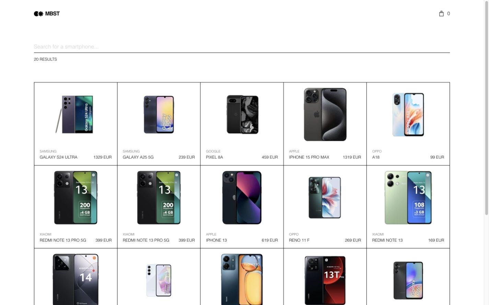
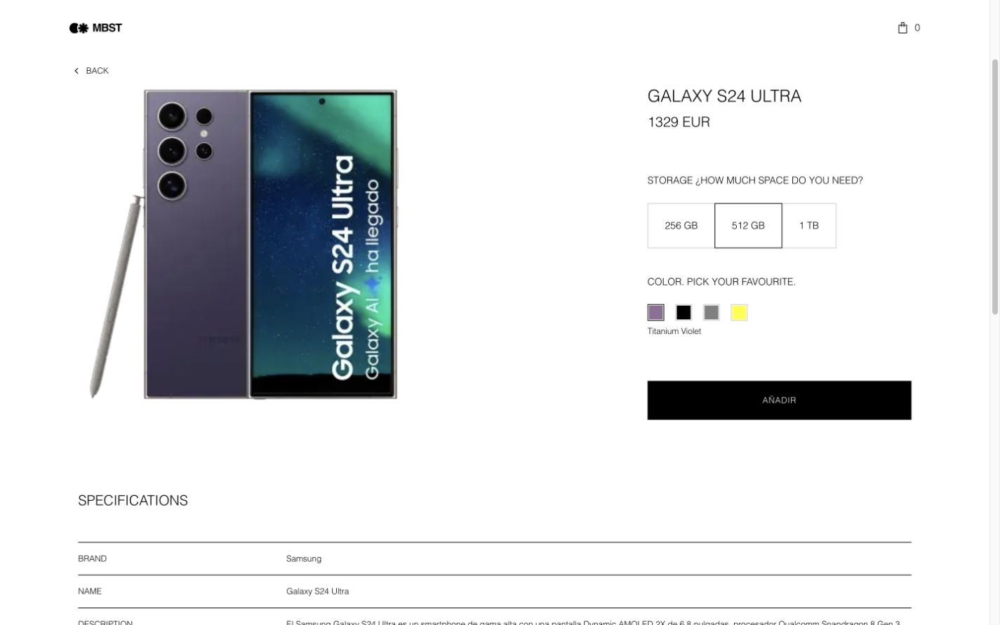
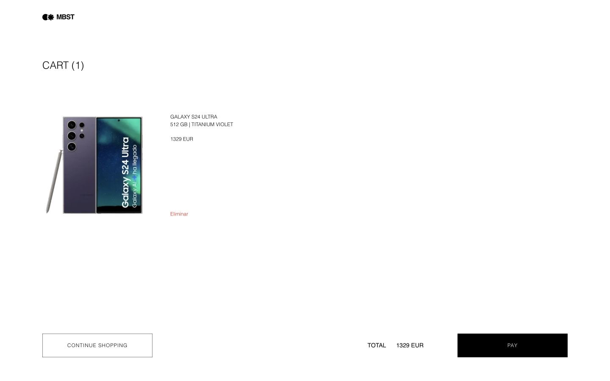

# Zara Smartphone Store

Aplicación web para explorar, buscar y configurar teléfonos móviles, desarrollada como solución a la prueba técnica frontend de Inditex/Zara. Incluye catálogo, detalle de producto y carrito persistente, con una implementación responsive y fiel al diseño de Figma.

**Demo:** [zara-challenge-five.vercel.app](https://zara-challenge-five.vercel.app/)

**Recursos del challenge:** [diseño en Figma](https://www.figma.com/design/Nuic7ePgOfUQ0hcBrUUQrb/Labs---Zara-Web-Challenge--Smartphones-) · [prototipo](https://www.figma.com/proto/Nuic7ePgOfUQ0hcBrUUQrb/) · [documentación de la API](https://prueba-tecnica-api-tienda-moviles.onrender.com/docs/)

## El reto

El enunciado pide una tienda de smartphones con tres vistas principales:

- Un listado con los primeros 20 productos, búsqueda en tiempo real por nombre o marca, contador de resultados y acceso al carrito.
- Un detalle con imagen dinámica, selección de almacenamiento y color, precio actualizado, especificaciones técnicas y productos similares.
- Un carrito persistente con las configuraciones elegidas, eliminación individual, precio total y vuelta al catálogo.

También exige testing, responsive, accesibilidad, linters y formatters, consola del navegador sin errores ni warnings, y documentación para ejecutar y comprender el proyecto. La solución implementa además los tres puntos opcionales del documento: despliegue, SSR con Next.js y variables CSS.

## Capturas

### Catálogo



### Detalle configurado



### Carrito



## Funcionalidades

- **Catálogo SSR:** muestra los primeros 20 teléfonos con imagen, marca, nombre y precio base.
- **Búsqueda por API:** filtra por nombre o marca con debounce de 300 ms, actualiza `?search=` en la URL y conserva la consulta al recargar, compartir o navegar por el historial.
- **Contador de resultados:** refleja la respuesta real de la API mediante una región `aria-live`.
- **Detalle configurable:** cambia la imagen al seleccionar color y sustituye el precio inicial por el precio de la capacidad elegida.
- **Selección accesible:** almacenamiento y color usan controles radio nativos, operables con teclado.
- **Añadir al carrito:** `AÑADIR` solo se habilita al elegir almacenamiento y color; al añadir, redirige a `/cart`.
- **Especificaciones:** presenta las características técnicas en una tabla semántica y omite `rating`, que no aparece en Figma.
- **Productos similares:** carrusel horizontal navegable por teclado, con carga diferida de imágenes.
- **Carrito persistente:** mantiene líneas independientes por configuración en `localStorage`, sincroniza cambios entre pestañas y evita mismatches de hidratación.
- **Gestión del carrito:** permite usar `Eliminar` sobre una línea concreta, calcula el total y ofrece `CONTINUE SHOPPING`.
- **Estados de carga:** conserva el header y deja el contenido vacío, acompañado por la línea de progreso del diseño; no utiliza skeletons ni spinners.
- **Responsive:** adapta listado, detalle, carrusel y carrito a mobile, tablet y desktop sin scroll horizontal accidental.

## Stack tecnológico

| Área      | Tecnología                                             |
| --------- | ------------------------------------------------------ |
| Framework | Next.js 15, App Router y Server Components             |
| Interfaz  | React 19 y TypeScript estricto                         |
| Estado    | React Context API + `useReducer`                       |
| Estilos   | SCSS Modules + variables CSS                           |
| Datos     | `fetch` de Next.js encapsulado en una capa server-only |
| Testing   | Vitest 3, Testing Library, MSW y vitest-axe            |
| Calidad   | ESLint 9, Prettier, Husky y lint-staged                |
| CI/CD     | GitHub Actions y Vercel                                |

## Puesta en marcha

### Requisitos

- Node.js 18.18 o superior dentro de la major 18.
- npm 9 o compatible.
- `nvm` recomendado; el repositorio incluye `.nvmrc`.

### Instalación

```bash
nvm use
cp .env.example .env
npm ci
npm run dev
```

La aplicación estará disponible en [http://localhost:3000](http://localhost:3000).

`.env.example` contiene `API_BASE_URL` y la credencial facilitada en el propio enunciado. `API_KEY` no usa el prefijo `NEXT_PUBLIC_`: las peticiones de la aplicación se realizan en servidor y la credencial no se incorpora al bundle cliente.

> La API está alojada en el plan gratuito de Render. La primera petición después de un periodo de inactividad puede tardar aproximadamente 60 segundos. Durante ese arranque en frío, la pantalla vacía con el header es el estado de carga intencional definido por Figma.

## Desarrollo y producción

```bash
npm run dev
```

Ejecuta el modo desarrollo de Next.js con assets sin minimizar.

```bash
npm run build
npm start
```

Genera y sirve la build de producción optimizada y minimizada.

## Scripts y calidad

| Script                  | Función                                     |
| ----------------------- | ------------------------------------------- |
| `npm run dev`           | Inicia el servidor de desarrollo            |
| `npm run build`         | Genera la build de producción               |
| `npm start`             | Sirve la build de producción                |
| `npm run lint`          | Ejecuta ESLint sobre el repositorio         |
| `npm run format`        | Formatea con Prettier                       |
| `npm run format:check`  | Comprueba el formato sin modificar archivos |
| `npm run typecheck`     | Ejecuta TypeScript con `--noEmit`           |
| `npm run test`          | Ejecuta la suite completa una vez           |
| `npm run test:watch`    | Ejecuta Vitest en modo watch                |
| `npm run test:coverage` | Genera el informe de cobertura V8           |

Husky y lint-staged ejecutan lint y formato antes del commit, y typecheck más tests antes del push. GitHub Actions usa la versión de `.nvmrc` y ejecuta instalación limpia, lint, formato, typecheck, tests y build en cada push a `master` y en cada pull request.

## Arquitectura

```text
src/
├── app/                  # Rutas App Router: catálogo, detalle y carrito
│   ├── cart/             # Vista y estilos del carrito
│   └── product/[id]/     # Detalle y loading boundary
├── components/           # Componentes, SCSS Modules y tests unitarios
├── context/              # CartContext, reducer y persistencia
├── services/             # Capa server-only de acceso a la API
├── styles/               # Tokens, breakpoints y estilos globales
├── test/                 # Setup, fixtures, MSW y suite axe
└── types/                # Tipos de producto y carrito
```

### Flujo de datos

1. El catálogo y el detalle son Server Components que leen parámetros de ruta y llaman a `src/services/api.ts`.
2. La capa de servicio añade `x-api-key`, aplica un timeout de 60 segundos, normaliza los datos y usa la revalidación de Next.js.
3. El buscador, los selectores y el carrito son islas cliente únicamente donde existe interacción.
4. La búsqueda vive en la URL; no existe una segunda copia global de ese estado.
5. CartContext mantiene el carrito con `useReducer`, lo hidrata después del mount y lo persiste en `localStorage`.

## Decisiones técnicas

### Next.js 15 sobre Node 18

El enunciado fija Node 18. Next.js 16 exige Node 20.9 o superior, por lo que Next.js 15 es la última major compatible con la restricción. La misma decisión mantiene Vitest 3 y Vite 6, evitando versiones que requieren Node 20.

Node 18 está fuera de soporte en un proyecto nuevo; fuera de esta prueba se utilizaría una versión LTS actual de Node junto con la versión vigente de Next.js.

### SSR y API server-only

Los productos se obtienen en Server Components mediante `src/services/api.ts`, protegido con el paquete `server-only`. Esto permite aprovechar SSR, evita peticiones directas desde el navegador y mantiene `x-api-key` fuera del JavaScript cliente durante la ejecución.

### Búsqueda URL-first

El buscador actualiza `?search=` con `router.replace` dentro de `useTransition`. La URL es la única fuente de verdad, por lo que refresh, back/forward y enlaces compartidos conservan la consulta sin introducir otra librería de fetching o caché cliente.

### Context API para el carrito

La prueba exige Context API para estado. CartContext usa `useReducer`, conserva configuraciones iguales como líneas independientes y se hidrata desde `localStorage` después del primer render para que servidor y cliente produzcan inicialmente el mismo HTML.

### Carga fiel a Figma

Los frames `Loading` y `Unloaded` muestran el header y el lienzo vacío. Por eso el proyecto no añade skeletons ni spinners. La única mejora es una línea de progreso compatible con `prefers-reduced-motion`.

### SCSS Modules y variables CSS

Los estilos son locales por componente y consumen tokens globales de color, tipografía, espaciado y layout. No existe CSS-in-JS en runtime ni Tailwind.

## Integración con la API

| Endpoint                         | Uso                                     |
| -------------------------------- | --------------------------------------- |
| `GET /products?limit=20&search=` | Catálogo y búsqueda por nombre o marca  |
| `GET /products/:id`              | Detalle, opciones y productos similares |

La API real presenta varios casos que se resuelven en la aplicación:

- **Ids duplicados:** las listas usan la key compuesta `${id}-${index}` para evitar warnings de React.
- **Imágenes HTTP:** todas las URLs se normalizan a HTTPS en la capa de servicio para evitar mixed content.
- **Precio por almacenamiento:** el precio de la capacidad sustituye a `basePrice`; no se suma. Antes de elegir se muestra `From {precio mínimo} EUR`.
- **Capacidades inconsistentes:** valores como `256 GB` y `128GB` se muestran tal como llegan.
- **Campo `rating`:** existe en la respuesta, pero se omite porque no forma parte del diseño.
- **Cold start:** las peticiones admiten hasta 60 segundos y se documenta el comportamiento esperado de Render.

## Testing

La suite actual contiene **92 tests en 16 archivos** y cubre:

- Capa API: autenticación, parámetros, errores y normalización HTTPS.
- Catálogo: límite, búsqueda, contador, cero resultados e ids duplicados.
- Detalle: precio mínimo, sustitución por storage, selección de color, cambio de imagen y activación de `AÑADIR`.
- Carrito: hidratación, persistencia, líneas duplicadas, eliminación individual, total y sincronización entre pestañas.
- Componentes interactivos: debounce, radiogroups, scroll accesible y estados de carga.
- Accesibilidad: smoke tests con axe sobre catálogo, detalle y carrito.

```bash
npm run test
npm run test:coverage
```

La suite axe se ejecuta en jsdom, que no calcula colores renderizados. Por eso la regla automática de contraste se desactiva en esos tests y el contraste se revisa manualmente contra los tokens del diseño. El resultado no se presenta como una certificación completa de conformidad WCAG.

## Accesibilidad y responsive

- Landmarks semánticos, listas reales, enlaces para navegación y botones para acciones.
- Radiogroups nativos para almacenamiento y color.
- Labels accesibles, imágenes descriptivas o decorativas según contexto y contador `aria-live`.
- Foco visible mediante `:focus-visible` y navegación completa con teclado.
- Carrusel horizontal sin bloqueo de teclado.
- Layouts comprobados en mobile, tablet y desktop, sin overflow horizontal accidental.

WCAG 2.2 AA se usa como referencia de diseño y revisión, no como afirmación de certificación formal.

## Despliegue

La aplicación está desplegada en Vercel con el preset de Next.js: [zara-challenge-five.vercel.app](https://zara-challenge-five.vercel.app/).

`API_BASE_URL` y `API_KEY` están configuradas como variables del proyecto. El catálogo y el detalle se renderizan en servidor, las imágenes se sirven por HTTPS y los deep links como `/product/SMG-S24U?search=samsung` y `/cart` funcionan al recargar directamente.

## Limitaciones conocidas

- La API de Render puede necesitar aproximadamente 60 segundos para despertar después de un periodo de inactividad.
- `PAY` es un control visual: el challenge no proporciona endpoint de checkout o pago.
- Node 18 se mantiene para cumplir el enunciado, aunque ya está fuera de soporte para un proyecto nuevo.
- La aplicación no agrega cantidades: configuraciones iguales permanecen como líneas independientes, de acuerdo con el diseño del carrito.
